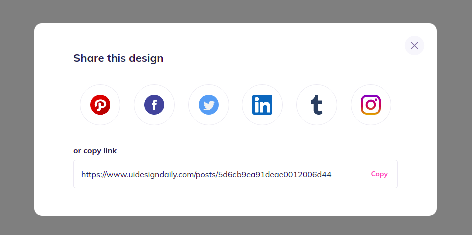

# Takip ettiğim kaynak [video](https://www.youtube.com/watch?v=q_Lxl8v__mg&list=PLfAfrKyDRWrGze_1T1bUU0qA9RknVKI5J&index=6) ve [kanal](https://www.youtube.com/c/PROTOTURKCOM).

## Önceden tasarlanan yapıları yazabilmek için yapılan bir egzersiz.
## Tasarıma ulaşmak için [tıklayınız](https://www.uidesigndaily.com/posts/sketch-share-post-social-day-913) 
---
