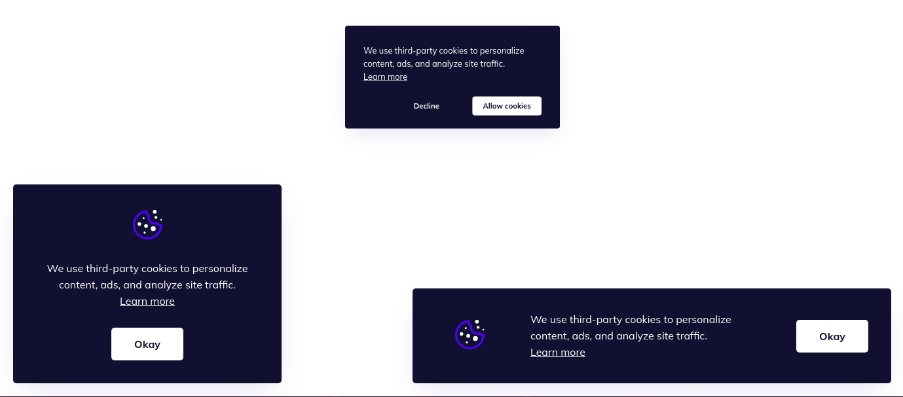

# Takip ettiğim kaynak [video](https://www.youtube.com/watch?v=XcpnlmwBI_U&list=PLfAfrKyDRWrGze_1T1bUU0qA9RknVKI5J&index=7) ve [kanal](https://www.youtube.com/c/PROTOTURKCOM).

## Önceden tasarlanan yapıları yazabilmek için yapılan bir egzersiz.
## Tasarıma ulaşmak için [tıklayınız](https://www.uidesigndaily.com/posts/sketch-cookie-banner-cookies-message-notification-day-1041) 
---
