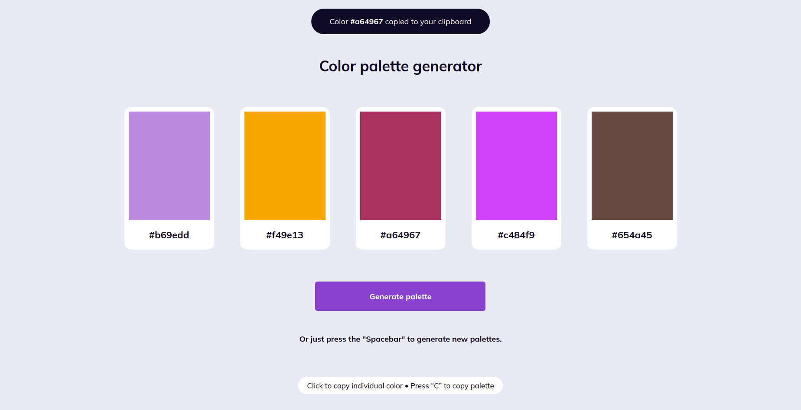

# Takip ettiğim kaynak [video](https://www.youtube.com/watch?v=V5oCDP4THQc&list=PLfAfrKyDRWrGze_1T1bUU0qA9RknVKI5J&index=8) ve [kanal](https://www.youtube.com/c/PROTOTURKCOM).

## Önceden tasarlanan yapıları yazabilmek için yapılan bir egzersiz.
## Tasarıma ulaşmak için [tıklayınız](https://www.uidesigndaily.com/posts/sketch-color-palette-generator-picker--day-1114) 
---
