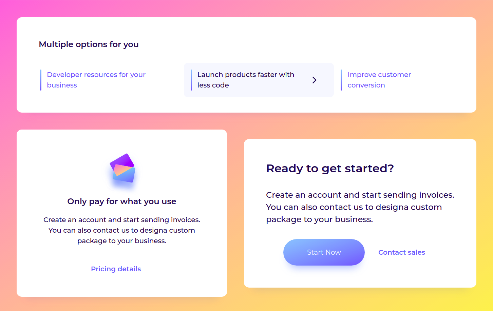

# Takip ettiğim kaynak [video](https://www.youtube.com/watch?v=PyCCMI9T6p8&list=PLfAfrKyDRWrGze_1T1bUU0qA9RknVKI5J&index=10) ve [kanal](https://www.youtube.com/c/PROTOTURKCOM).

## Önceden tasarlanan yapıları yazabilmek için yapılan bir egzersiz.
## Tasarıma ulaşmak için [tıklayınız](https://www.uidesigndaily.com/posts/sketch-website-components-button-card-link-day-1191) 
---
