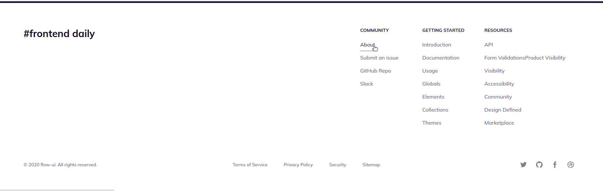

# Takip ettiğim kaynak [video](https://www.youtube.com/watch?v=3OGmE-WUWKI&list=PLfAfrKyDRWrGze_1T1bUU0qA9RknVKI5J&index=12) ve [kanal](https://www.youtube.com/c/PROTOTURKCOM).

## Önceden tasarlanan yapıları yazabilmek için yapılan bir egzersiz.
## Tasarıma ulaşmak için [tıklayınız](https://www.uidesigndaily.com/posts/sketch-footer-website-day-1014) 
---
