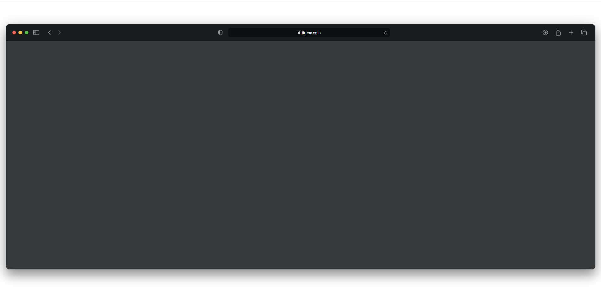

# Takip ettiğim kaynak [video](https://www.youtube.com/watch?v=ADUWLv9TBvg&list=PLfAfrKyDRWrGze_1T1bUU0qA9RknVKI5J&index=22) ve [kanal](https://www.youtube.com/c/PROTOTURKCOM).

## Önceden tasarlanan yapıları yazabilmek için yaptığım bir egzersiz.
## Tasarıma ulaşmak için [tıklayınız](https://www.figma.com/file/EqO42KvCBt2ELgbf8hKXQa/macOS-Browser-UI-Kit-Big-Sur-Update-Community?node-id=1009%3A150). 
---
