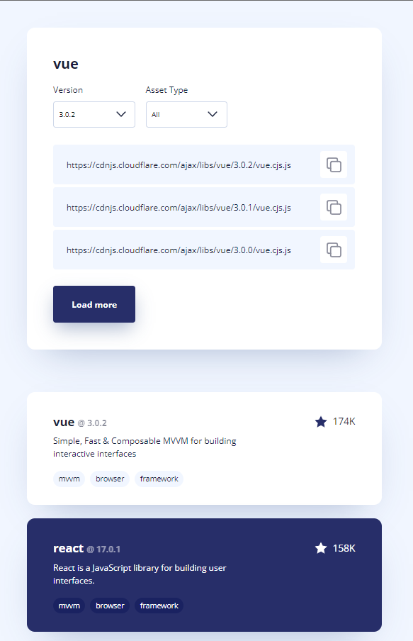

# Takip ettiğim kaynak [video](https://www.youtube.com/watch?v=KOLoyHk_JJQ&list=PLfAfrKyDRWrGze_1T1bUU0qA9RknVKI5J&index=23) ve [kanal](https://www.youtube.com/c/PROTOTURKCOM).

## Önceden tasarlanan yapıları yazabilmek için yaptığım bir egzersiz.
## Tasarıma ulaşmak için [tıklayınız](https://www.uidesigndaily.com/posts/sketch-ui-components-card-list-button-dropdown-day-1215). 
---
