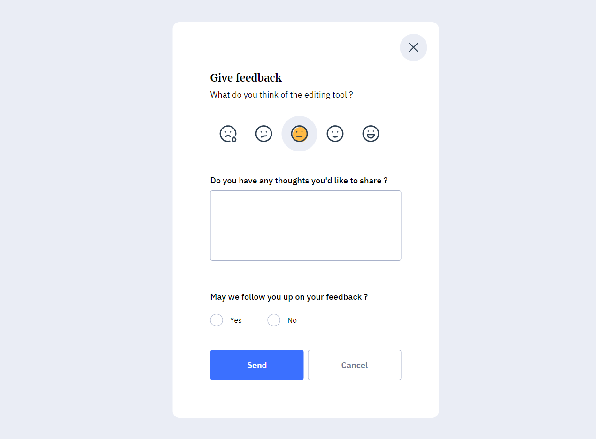

# Takip ettiğim kaynak [video](https://www.youtube.com/watch?v=uSio0cxJnXI&list=PLfAfrKyDRWrGze_1T1bUU0qA9RknVKI5J&index=25) ve [kanal](https://www.youtube.com/c/PROTOTURKCOM).

## Önceden tasarlanan yapıları yazabilmek için yaptığım bir egzersiz.
## Tasarıma ulaşmak için [tıklayınız](https://www.uidesigndaily.com/posts/sketch-feedback-modal-card-day-1265). 
---
