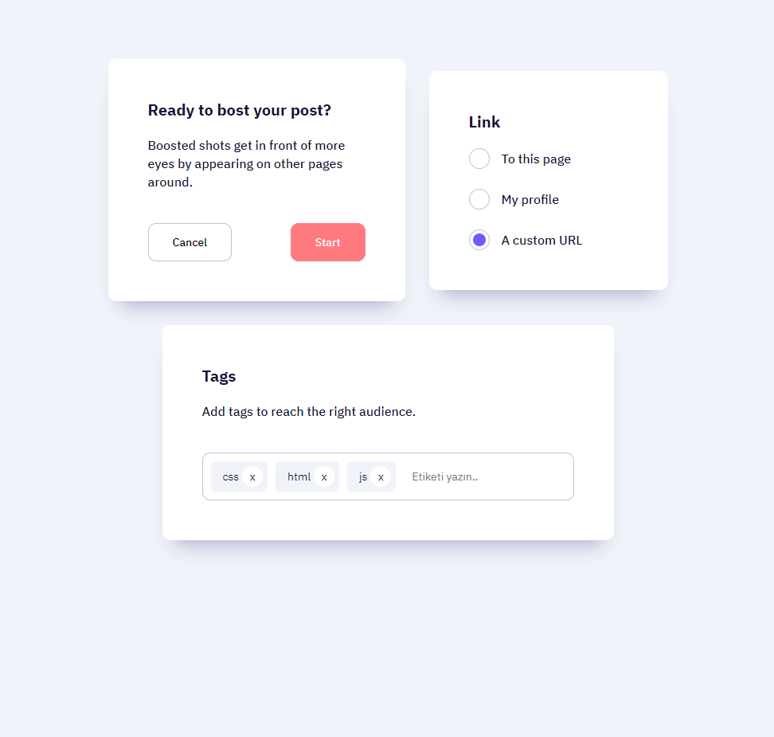

# Takip ettiğim kaynak [video](https://www.youtube.com/watch?v=-XeUkvdn3OE&list=PLfAfrKyDRWrGze_1T1bUU0qA9RknVKI5J&index=28) ve [kanal](https://www.youtube.com/c/PROTOTURKCOM).

## Önceden tasarlanan yapıları yazabilmek için yaptığım bir egzersiz.
## Tasarıma ulaşmak için [tıklayınız](https://www.uidesigndaily.com/posts/sketch-cards-card-settings-tags-day-1224). 
---
